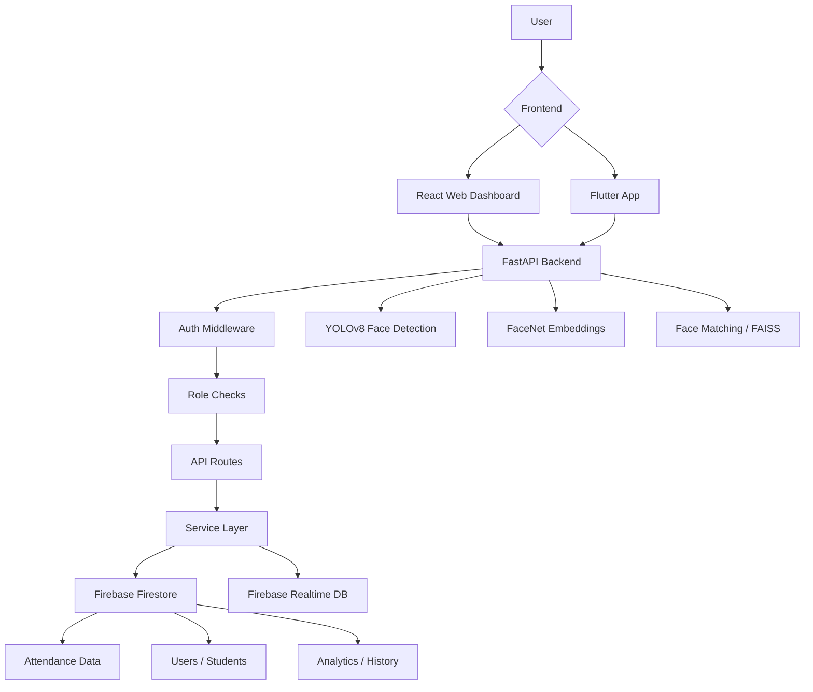
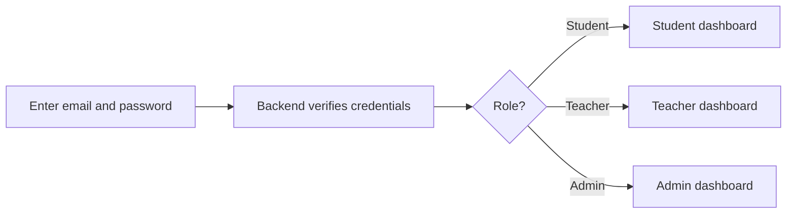
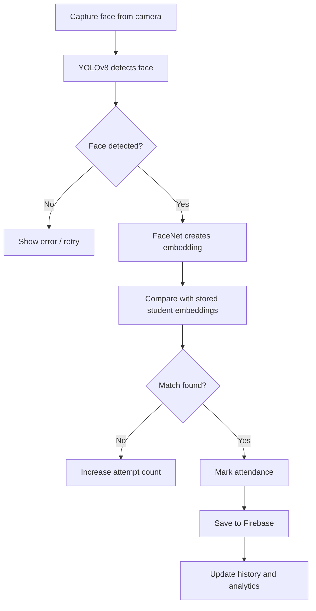
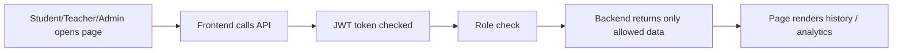

# Smart Attendance System - Mentor Evaluation Guide

This document explains the project in simple words for viva or mentor evaluation.

## 1. What This Project Does

Smart Attendance System is an attendance automation platform for colleges and schools.

It helps with three main things:

1. Recognize a student using face detection.
2. Mark attendance automatically and store it safely.
3. Show history, analytics, and dashboards for students, teachers, and admins.

In short: the system replaces manual attendance with fast, secure, and trackable digital attendance.

## 2. Why This Project Is Useful

Manual attendance has problems:

- It takes time in every class.
- Teachers can make entry mistakes.
- Students may mark attendance for someone else.
- It is difficult to see reports quickly.

This system solves those problems by:

- identifying students by face,
- keeping attendance data in Firebase,
- showing instant dashboards,
- and separating access by role.

## 3. Feasibility In Simple Words

This project is feasible because the required building blocks already exist and work together well:

- **Face detection** uses YOLOv8.
- **Face matching** uses FaceNet embeddings.
- **Data storage** uses Firebase Firestore and Realtime Database.
- **Backend** uses FastAPI, which is fast and easy to organize.
- **Frontend** uses React and Flutter, so users can see the system on web and mobile.

Why this is practical:

- It can run locally on a laptop.
- It can scale later to multiple users.
- It uses standard, known technologies.
- The architecture is already split into clear layers.

## 4. Main Technologies Used

### Backend

- FastAPI for APIs
- Python for business logic
- Firebase Admin SDK for database access and authentication

### AI / ML

- YOLOv8 for face detection
- FaceNet for face embeddings
- Similarity search for matching the detected face with a student

### Frontend

- React web dashboard for admins and staff
- Flutter app for mobile/web usage

### Database

- Firestore for structured records
- Realtime Database for live and legacy sync

## 5. Simple Architecture Diagram

## 6. How The System Works End To End

### Step 1: Login

- User logs in with email and password.
- Backend creates or verifies a JWT token.
- The token contains the user role: admin, teacher, or student.

### Step 2: Open Dashboard

- Frontend sends the token with every API request.
- Backend checks the token and role.
- Based on the role, the user sees different screens.

### Step 3: Face Detection

- Camera captures an image.
- YOLOv8 detects whether a face exists in the image.
- If a face is found, the system tries to match it.

### Step 4: Face Matching

- FaceNet converts the face into a numeric embedding.
- The embedding is compared with stored student embeddings.
- If similarity is high enough, the student is identified.

### Step 5: Attendance Marking

- If the student is matched successfully, attendance is marked.
- The record is stored in Firebase.
- Analytics and history pages can read the updated data.

### Step 6: Reports And Insights

- Student sees personal attendance history and analytics.
- Teacher sees section/class-based data.
- Admin sees full system-wide data.

## 7. Core Workflow Diagrams

### A. Login and Access Workflow

### B. Face Attendance Workflow

### C. Data Viewing Workflow

## 8. Inputs And Outputs

### Inputs

- Login email and password
- Camera image for face recognition
- Student ID, course, or section filters for reports
- Date and time filters for history

### Outputs

- Attendance marked as present, late, or absent
- Student attendance history
- Analytics percentages and trends
- Teacher class/section summary
- Admin system-wide reports

## 9. Important Modules And Their Purpose

### Backend Modules

- `api/` - API endpoints for login, attendance, student data, admin data
- `services/` - Business logic such as matching, marking, analytics, and Firebase operations
- `database/` - Firebase access layer
- `models/` - AI/ML model helpers
- `middleware/` - Authentication, authorization, audit, and rate limiting
- `config/` - Settings and constants

### Frontend Modules

- `web-dashboard/` - Admin and staff dashboard
- `attendance_app/` - Flutter app for mobile/web users

## 10. Important APIs In Simple Words

### Authentication APIs

- `POST /api/v1/auth/login` - log in and get a token
- `GET /api/v1/auth/me` - get current user info
- `POST /api/v1/auth/logout` - end session

### Student APIs

- `GET /api/v1/student/attendance/today` - show today’s attendance
- `GET /api/v1/student/attendance/history` - show attendance history
- `GET /api/v1/student/dashboard` - show student dashboard view
- `GET /api/v1/student/timetable` - show timetable
- `GET /api/v1/student/attendance-summary` - show attendance percentage summary
- `GET /api/v1/student/warnings` - show low attendance warnings

### Attendance APIs

- `POST /api/v1/attendance/detect-face` - detect face and mark attendance
- `GET /api/v1/attendance/history` - attendance history for staff/admin
- `GET /api/v1/attendance/today` - today’s records

### Admin APIs

- `GET /api/v1/admin/analytics/trends` - institution analytics
- `GET /api/v1/admin/analytics/student/{student_id}` - drill down into one student
- `GET /api/v1/admin/attendance/today` - admin attendance view

### Teacher APIs

- `GET /api/v1/teacher/analytics/section` - section-level analytics
- `GET /api/v1/teacher/sections` - assigned sections

## 11. Role Based Access

### Admin

- Can see everything.
- Can manage users, attendance, analytics, and system data.

### Teacher

- Can see only assigned sections.
- Can mark attendance and view class analytics.

### Student

- Can see only their own history and analytics.
- Cannot edit records.

## 12. Why The Design Is Good

- Simple separation of responsibilities.
- Secure because access is token-based.
- Easy to maintain because frontend, backend, and database logic are separated.
- Easy to explain because each layer has a clear job.

## 13. One-Line Summary For Viva

“This project is a smart attendance system that uses face recognition, secure APIs, and Firebase storage to automatically mark attendance and show role-based dashboards for students, teachers, and admins.”

## 14. Suggested Demo Flow

1. Login as student.
2. Show dashboard and attendance history.
3. Login as teacher.
4. Show section-level view.
5. Login as admin.
6. Show analytics and full history.
7. Show face attendance marking.
8. Show how data updates in history and analytics.
