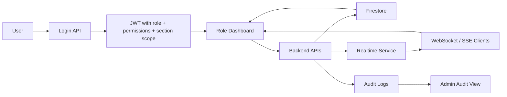
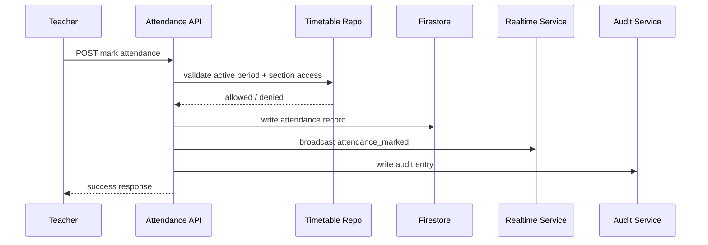

# Smart Attendance System - Redesign Plan

## Current Issues
1. ❌ No role-based access control (RBAC)
2. ❌ All attendance data visible to all users
3. ❌ No timetable-based attendance workflow
4. ❌ Dashboard shows generic data, not role-specific
5. ❌ Students can see/mark attendance for all classes
6. ❌ No real-time dashboard updates
7. ❌ Missing Admin/Student/Teacher roles

## Redesign Objectives

### 1. Authentication & Authorization Layer
- Separate login for Admin, Teachers, Students
- JWT-based token system with role claims
- Permission checks at API level (not frontend)
- Session management with expiry

### 2. Timetable-Driven Workflow
- Attendance marking only during scheduled periods
- Auto-lock attendance after class period ends
- Teachers can only mark for their assigned classes
- Real-time validation against timetable

### 3. Data Isolation & Security
- Students see only their own attendance
- Teachers see only their assigned sections/classes
- Admin sees all data with analytics
- Course-section-student mapping in database

### 4. Dashboard Intelligence
- Role-specific views (Admin/Teacher/Student)
- Real-time update when attendance is marked
- Attendance rate calculations per section
- Period-wise attendance trends

### 5. API Security
- Role-based endpoint access
- Resource-level authorization checks
- Audit logging for all attendance changes
- Rate limiting per role

### 6. State Management
- Separation of concerns (UI vs Business Logic)
- Backend-driven authorization (not trusting frontend)
- Consistent state across web/mobile

## Reference Architecture Comparison

### How Industry Apps Work (Jigsaw, MangoERP, etc.)
1. **Role Assignment**: Admin creates users with roles
2. **Login**: User logs in, gets JWT with role+permissions
3. **View Filtering**: Each page shows only user's data
4. **Action Validation**: Server validates every action against role
5. **Audit Trail**: All changes logged with user+timestamp
6. **Real-time Sync**: WebSocket for instant updates

### Our Redesigned Approach
- Admin Panel: User mgmt, section assignment, timetable upload
- Teacher Portal: Mark attendance for assigned classes during period
- Student Dashboard: View personal attendance + analytics
- Real-time sync: WebSocket events when attendance changes
- Audit Log: Track all attendance changes with admin who made it

## Files to Modify

### Backend API
- `attendance_backend/api/admin.py` - Role checks
- `attendance_backend/api/teacher.py` - NEW: Teacher endpoints
- `attendance_backend/api/student.py` - Restrict to own data
- `attendance_backend/api/auth.py` - NEW: Auth with roles
- `attendance_backend/schemas/` - Add role/permission schemas
- `attendance_backend/database/` - Role-based queries
- `attendance_backend/config/constants.py` - Permission mappings

### Database
- `attendance_backend/models/` - User roles, permissions
- Firestore collections: users, roles, permissions, courses, sections, timetable

### Frontend
- No changes needed - same UI, different data served

## Deployment Strategy
1. Create new permission/role system (backward compatible)
2. Update database with user roles
3. Update API to check permissions
4. Create login page (simple form)
5. Test each role separately
6. Gradual rollout

---

## 6 Claude Prompts (See below)

## PROMPT 6: Integrated System Architecture & Implementation Roadmap

This section is the integration plan for the redesigned attendance system. It ties together authentication, timetable validation, section isolation, realtime fan-out, and audit logging so the full flow works end to end without frontend changes.

### Target End-to-End Flow

1. User logs in and receives a JWT with role, permissions, and section scope.
2. Frontend redirects to the role-specific dashboard.
3. Dashboard requests only backend-filtered data for the current role.
4. Teacher marks attendance only during an active timetable window for an assigned section.
5. Backend writes the attendance record, broadcasts a realtime event, and writes an audit log entry.
6. All clients viewing that section update in realtime; if realtime is unavailable, they fall back to polling cached API endpoints.

### Role Flows

#### Admin Flow

- Login -> `/api/v1/auth/login`
- Redirect -> admin dashboard
- Manage users, sections, enrollments, course assignments, and timetable
- View system-wide analytics and audit logs
- May inspect any section through admin-only endpoints

#### Teacher Flow

- Login -> `/api/v1/auth/login`
- Redirect -> teacher dashboard
- Load assigned sections from JWT claims plus Firestore verification
- See only timetable windows for assigned sections
- Mark attendance only for the active period
- View section dashboard with realtime updates

#### Student Flow

- Login -> `/api/v1/auth/login`
- Redirect -> student dashboard
- Load only own section and own attendance history
- View personal analytics and attendance trend
- Subscribe to section realtime feed for personal updates

### Data Flow Diagram

### API Call Sequences

#### Login and Dashboard Boot

1. `POST /api/v1/auth/login`
2. Backend returns JWT, role, permissions, assigned sections, and dashboard target
3. Frontend navigates to `/admin`, `/teacher`, or `/student`
4. Dashboard calls role-specific API endpoints with the JWT

#### Teacher Attendance Marking

1. `GET /api/v1/teacher/periods/active`
2. `GET /api/v1/teacher/active-class?section_id=...`
3. `POST /api/v1/attendance/mark`
4. Backend validates role, section ownership, timetable window, and rate limit
5. Backend writes attendance, broadcasts event, logs audit trail

#### Student Attendance View

1. `GET /api/v1/student/dashboard`
2. `GET /api/v1/student/attendance/history`
3. `GET /api/v1/student/realtime/token`
4. Connect to `/api/v1/realtime/sse/{section_id}` or `/ws/{section_id}`

#### Admin Management Flow

1. `GET /api/v1/admin/users`
2. `POST /api/v1/sections`
3. `POST /api/v1/assignments`
4. `POST /api/v1/timetable/bulk-import`
5. `GET /api/v1/audit/logs`

### Error Handling Strategy

- Authentication failure returns `401` and redirects to login.
- Permission failure returns `403` with a role-specific message.
- Invalid section access returns `403` before any Firestore write.
- Out-of-window attendance returns `423 Locked` or `409 Conflict` depending on the route.
- Realtime connection failure does not block attendance writes.
- Audit write failure is logged server-side but never breaks the main request.
- Rate limit violations return `429` with retry hints.

### Fallback Behavior When Realtime Fails

- Teacher and student dashboards poll cached endpoints every 5 seconds.
- Realtime subscription failures fall back to the same section-scoped REST response.
- The last known section snapshot is kept in the in-memory cache so the UI remains usable.
- Attendance writes are always the source of truth; realtime is only a notification channel.

### Testing Strategy for Permission Isolation

1. Unit test role claims and JWT parsing.
2. Unit test decorator behavior for admin, teacher, and student routes.
3. Repository tests ensure `section_id` is always the first Firestore filter.
4. API tests verify cross-section access is denied for teachers and students.
5. Realtime tests ensure section-only event fan-out.
6. Audit tests verify attendance mutations generate immutable audit rows.
7. Rate limit tests verify per-role thresholds and `429` responses.
8. Integration tests simulate login -> dashboard -> mark attendance -> broadcast -> audit.

### Implementation Roadmap

#### Phase 1, Week 1: Auth, Roles, Permissions

- Finalize JWT claims for role and section scope.
- Wire `AuthMiddleware`, `PermissionMiddleware`, and role decorators.
- Ensure dashboards request only role-specific endpoints.
- Files to update first:
	- `attendance_backend/main.py`
	- `attendance_backend/config/constants.py`
	- `attendance_backend/services/auth_service.py`
	- `attendance_backend/decorators/auth_decorators.py`
	- `attendance_backend/middleware/auth_middleware.py`
	- `attendance_backend/middleware/permission_middleware.py`

#### Phase 2, Week 2: Timetable Validation and Section Isolation

- Validate that attendance only opens inside the assigned timetable window.
- Confirm section ownership in teacher and student APIs.
- Ensure repository queries always filter by section context.
- Files to update next:
	- `attendance_backend/database/firebase_client.py`
	- `attendance_backend/database/attendance_repository.py`
	- `attendance_backend/database/timetable_repository.py`
	- `attendance_backend/api/attendance.py`
	- `attendance_backend/api/teacher.py`
	- `attendance_backend/api/student.py`
	- `attendance_backend/api/sections.py`

#### Phase 3, Week 3: Realtime Updates

- Broadcast attendance changes to section subscribers.
- Add WebSocket and SSE subscription endpoints.
- Add client-side fallback polling using cached section snapshots.
- Files to update next:
	- `attendance_backend/services/realtime_service.py`
	- `attendance_backend/api/websocket.py`
	- `attendance_backend/api/teacher.py`
	- `attendance_backend/api/student.py`

#### Phase 4, Week 4: Audit Logging and Security Hardening

- Write immutable audit rows for all attendance mutations.
- Apply rate limiting and request-body sanitization.
- Validate admin-only access for section management.
- Add tests for denial paths and error handling.
- Files to update last:
	- `attendance_backend/services/audit_services.py`
	- `attendance_backend/middleware/audit_middleware.py`
	- `attendance_backend/utils/rate_limiter.py`
	- `attendance_backend/api/admin.py`
	- `attendance_backend/api/teacher.py`
	- `attendance_backend/api/student.py`

### File-by-File Modification Order

1. `attendance_backend/main.py` - register middleware and startup services.
2. `attendance_backend/config/constants.py` - role matrix, limits, and route settings.
3. `attendance_backend/services/auth_service.py` - JWT claims, role helpers, section scope.
4. `attendance_backend/decorators/auth_decorators.py` - role and resource guards.
5. `attendance_backend/middleware/auth_middleware.py` - decode tokens and attach user context.
6. `attendance_backend/middleware/permission_middleware.py` - inject query filters and enforce route roles.
7. `attendance_backend/middleware/audit_middleware.py` - log mutating requests.
8. `attendance_backend/utils/rate_limiter.py` - per-role request throttling.
9. `attendance_backend/database/firebase_client.py` - section-first query support.
10. `attendance_backend/database/attendance_repository.py` - role-aware attendance access.
11. `attendance_backend/database/timetable_repository.py` - period detection and window queries.
12. `attendance_backend/api/sections.py` - manage courses, sections, enrollments, and assignments.
13. `attendance_backend/api/teacher.py` - section-scoped attendance and dashboard access.
14. `attendance_backend/api/student.py` - own-record filtering and realtime token access.
15. `attendance_backend/api/admin.py` - admin-only management and analytics.
16. `attendance_backend/api/websocket.py` - realtime subscriptions and broadcast integration.
17. `attendance_backend/services/realtime_service.py` - websocket/SSE fan-out and cache invalidation.
18. `attendance_backend/services/audit_services.py` - write immutable audit records.
19. `attendance_backend/schemas/` - request and response validation for all role-specific flows.
20. `attendance_backend/tests/` and `attendance_backend/scripts/` - isolate permissions, realtime, and audit behavior.

### Firestore Collections

- `users` - roles, permissions, and section assignment.
- `courses` - course catalog.
- `sections` - section metadata and capacity.
- `enrollments` - student-to-section mapping.
- `course_assignments` - teacher-to-section mapping.
- `timetable` - section-scoped period schedule.
- `attendance` - attendance rows with `section_id` context.
- `audit_logs` - immutable security and attendance history.

### Success Criteria

- Admin can manage users, sections, and timetable.
- Teachers can mark attendance only for assigned sections and only during valid periods.
- Students can see only their own attendance and analytics.
- All attendance changes are audited.
- Realtime updates work for everyone viewing the same section.
- The frontend remains unchanged because filtering is enforced on the backend.
